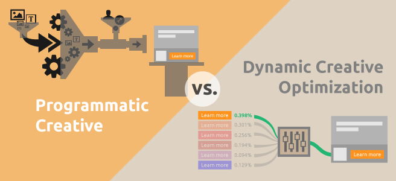

# Computer Vision for Creative Optimisation: KPI maximisation through image analysis
> Sample Dynamic creative optimisation



## Project details

**Table of contents**

- [Introduction](#introduction)
- [Overview](#overview)
- [Objective](#objective)
- [Data](#data)
- [Requirements](#requirements)
- [Install](#install)
- [Using the application](#examples)
- [Screenshots](#screenshots)
- [Notebooks](#notebooks)

## Introduction

> This week challenge mainly focus on the Computer vision and deep learning creative advertised,
on the Adluio company. The assignment is to use computer vision techniques based on deep
learning to creatively optimize mobile advertising. Computer vision technology has transformed
the world by allowing machines to achieve human-level understanding of images and videos.
The success of deep learning based computer vision has led to a number of novel applications
such as Autonomous driving for cars, tumour detection from X-rays, farm weed detection and
yield prediction from satellite and drone images, visual try-on features for clothes and jewellery
in e-commerce, and many more.

## Objective

> Adludio, an online mobile advertising company, is our customer this week. The following
service is offered to customers by Adludio. Create a creative, often known as an interactive
advertisement. A rich advertisement including interactive features such as a mini-game engine,
video, text, and photos is referred to as a creative. On behalf of a client, makes these creatives
available to viewers. Real-time bidding is used by Adludio to purchase impressions on an open
market. Utilizing sophisticated machine learning algorithms, optimizes the process of creative
designing while also focusing on guaranteed inventory.
> Adludio has been running a huge number of commercials, and each one has a unique Creative.
These designs were produced based on the designers' prior work and the requirements of the
business. There is no way to assess creatives during production and predict how well they might
perform once they are served. Adludio aims to address this issue by creating an algorithm that
enables it to optimize its creatives in light of campaign performance information. We are
entrusted with creating a computer vision system based on deep learning that separates items
from creative assets and associates them with KPI criteria of the related campaigns in order to
achieve that.

## Data
> The Dataset Archive is composed of an ‘Assets’ folder and a ‘performance_data’ CSV file. As
the names suggest, the folder contains the asset image used to build the creatives and the CSV
file contains the performance values for each creative. Each folder within the ‘Assets’ folder is a
‘game_id’ string value, and its reference performance is available in the CSV file.
➢ Game_id - Represents a unique identifier of a creative for the performance values.
➢ ER - Represents the engagement rate score of the creative.
➢ CTR - Represents the click-through rate score of the creative.
## Requirements
- Python > 3.5
- Docker
- pip install -r requirements.txt
## Installation

Use the package manager [pip](https://pip.pypa.io/en/stable/) to install OpenCV.

```bash
pip install opencv-python
```

## Screenshots

> The detailed use and implementation

## Notebooks

> All the notebooks that are used in this project including EDA, data cleaning and summarization along with some machine learning model generations are found here in the Notebooks folder.

## Scripts

> All the scripts and modules used for this project relating to interactions with kafka, airflow, and other frameworks along with default parameters and values used will be found here, in the scripts folder.

## Contributing
Pull requests are welcome. For major changes, please open an issue first to discuss what you would like to change.

> 👤 **

## Show us your support

> Give us a ⭐ if you like this project, and also feel free to contact us at any moment.


